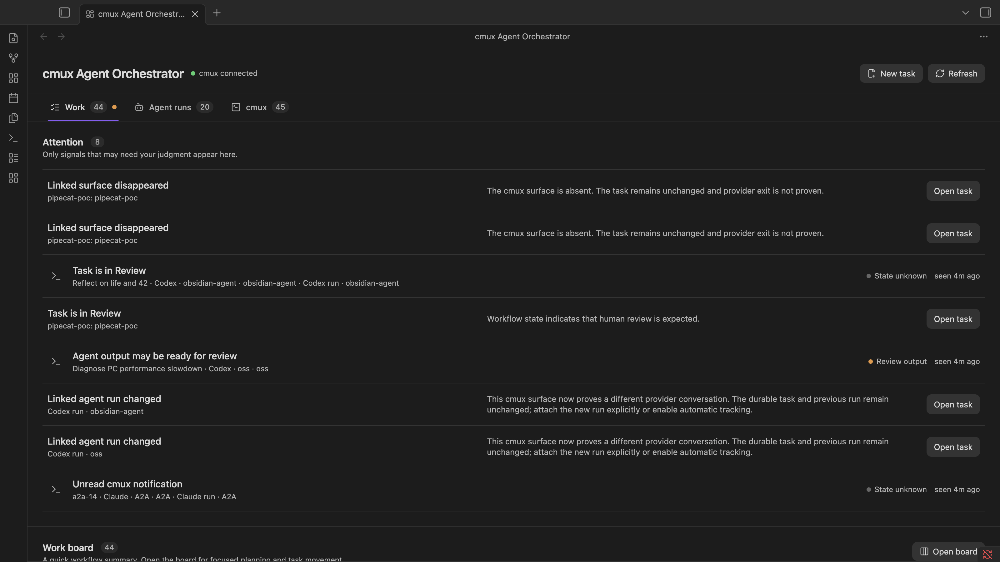
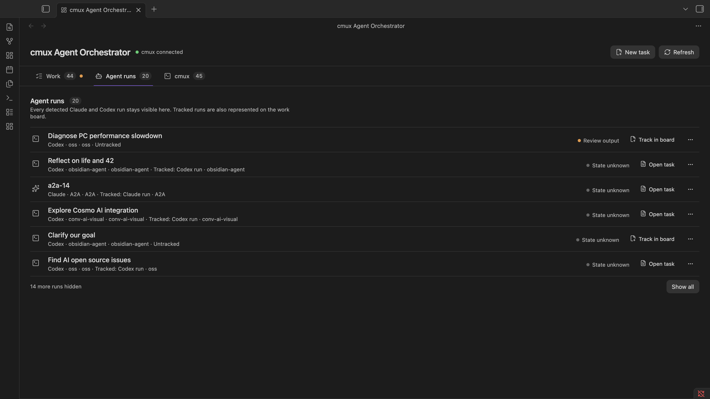
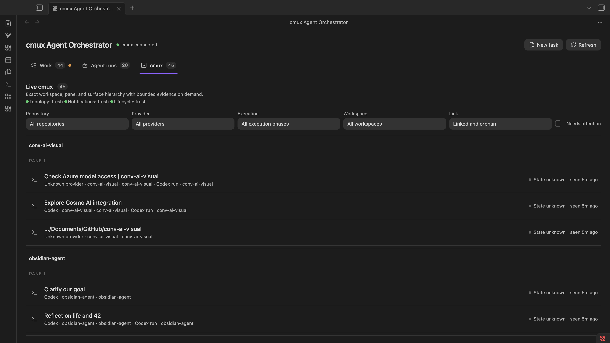

# cmux Agent Orchestrator

cmux Agent Orchestrator is a desktop-only Obsidian community plugin for coordinating Claude Code and Codex CLI sessions that already run inside cmux. It is a human-in-the-loop orchestration layer: Obsidian owns durable work context, cmux remains the terminal and process owner, and each provider retains its own session state.

The repository currently targets Obsidian 1.10.x and the installed cmux 0.62.2 command surface. It has no runtime npm dependencies, telemetry, hosted service, or external network requirement.

## Install

Install cmux Agent Orchestrator from its [Obsidian Community Plugins listing](https://community.obsidian.md/plugins/cmux-agent-orchestrator), or [open it directly in Obsidian](obsidian://show-plugin?id=cmux-agent-orchestrator).

## Screenshots

### Work



### Agent runs



### cmux



## What the current build provides

- One native Obsidian `ItemView`, opened from the ribbon or command palette.
- Three focused native modes: Work for attention and the durable board, Agent runs for untracked Claude/Codex executions, and cmux for the exact terminal tree.
- All five workflow columns are always visible, including in a brand-new vault with no task notes.
- Canonical workspace, pane, and surface UUIDs from cmux JSON output.
- Conservative Claude, Codex, shell, and unknown detection with evidence and confidence.
- Automatic provider conversation titles when an exact surface/process/session correlation is provable, with a manual picker fallback.
- Default-on automatic Work tracking for exact, uniquely resolved Claude and Codex sessions, with an opt-out in settings and manual review for ambiguous runs.
- Bounded, memory-only terminal previews loaded only when a session is expanded or explicitly requested.
- Exact Focus in cmux with fresh target resolution and bounded postcondition retries.
- Markdown task creation and workflow states: Backlog, Active, Review, Parked, and Done.
- Machine-scoped task, run-history, surface, and provider-conversation bindings in schema-v3 plugin data.
- Orphan sessions and stale bindings.
- Clear cmux disconnected, blocked, malformed-output, timeout, and output-limit states.
- One-time GUI onboarding for normal Finder, Dock, and Spotlight launches when cmux rejects external clients.

cmux Agent Orchestrator does not host a PTY, autonomously resume providers, send terminal input, read complete transcripts, or decide that a task is complete.

## Ownership boundary

| System | Owns |
|---|---|
| cmux | Workspaces, panes, terminal surfaces, process lifetime, and terminal interaction |
| Claude Code and Codex | Provider conversation and session persistence |
| cmux Agent Orchestrator | Runtime observations, task associations, human-directed coordination, and narrow explicit actions |
| Markdown notes | Human-owned goals, criteria, context, decisions, run summaries, and outcomes |

Agent evidence and workflow state are deliberately independent. A quiet, missing, errored, or ended session never moves a task to Done.

Exact, uniquely resolved Claude and Codex sessions become one neutral Active Markdown task and Work card by default. Identity is deduplicated by provider plus canonical session ID, so a refresh or reload cannot create a second task for the same run. Conversation titles remain memory-only and appear on the live card; they are never copied into an automatically created note. Ambiguous, heuristic-only, duplicate, shell, and unknown sessions remain in Agent runs for manual review. Turning automatic tracking off stops new automatic tasks, and manually detaching a run prevents later refreshes from silently recreating it. Neither automatic nor manual tracking messages, resumes, interrupts, or otherwise controls the provider.

`Track in board` remains available for manual cases: it opens a prefilled form, writes an Active durable task note, and attaches the exact cmux surface. The row's overflow menu provides Focus in cmux, Attach to existing task, and Choose provider conversation. Choosing a provider conversation manually overrides the automatic identity. Moving any Work card changes workflow only; runtime state never changes Backlog, Active, Review, Parked, or Done on the user's behalf.

## Build

Requirements:

- macOS
- Node.js 22.13 or newer
- npm
- Obsidian desktop 1.10 or newer
- cmux 0.62.2 for the currently tested parser fixtures

```bash
npm install
npm run check
```

`npm run build` creates `main.js` in this repository. For a manual Obsidian installation, copy `main.js`, `manifest.json`, and `styles.css` into a vault-local `.obsidian/plugins/cmux-agent-orchestrator/` directory. The build command does not install the plugin into a vault.

Maintainers should follow the complete [release procedure](docs/RELEASING.md), including the normal macOS launch and vault-local safety checks, before creating a tag.

## Storage

Markdown task notes default to `Agent Cockpit/Tasks/` and contain durable fields only. The pre-release folder and frontmatter marker remain stable so existing task notes continue to load after the public rename:

```yaml
---
agent-cockpit: task
schema-version: 1
task-id: stable-uuid
title: Human-readable task title
workflow-status: active
priority: normal
repository:
branch:
worktree:
run-count: 0
created-at:
updated-at:
---
```

cmux UUIDs and provider observations do not go into task frontmatter. Automatically created notes use a deterministic task UUID derived from the provider kind and canonical provider session ID without embedding or displaying that original ID. Plugin `data.json` schema version 3 stores settings, surface bindings, durable run relationships, and exact cmux-surface-to-provider-session-ID mappings under a one-way hashed machine namespace. Existing schema-v1 and schema-v2 data migrate in memory and are written as v3 on the next plugin-data mutation. Conversation titles, provider previews, terminal previews, notification bodies, evidence ledgers, output fingerprints, and source-health snapshots remain memory-only.

A task may own several runs and several currently attached surfaces. Each binding has its own canonical binding ID and run ID. Reattaching the same surface/provider run reuses that run; a different provider is recorded as a handoff; uncertain same-provider relationships remain explicitly `unknown` rather than being invented as a resume or fork.

## cmux transport

The `CmuxTransport` interface keeps CLI snapshots replaceable by a future socket/event transport. `CliCmuxTransport` invokes only an executable file named `cmux`, with `spawn` and exact argument arrays. It never uses `exec`, `sh -c`, command interpolation, or text from Markdown.

Read-only allowlist:

```text
cmux --version
cmux --json capabilities
cmux --json --id-format uuids tree --all
cmux --json --id-format uuids list-workspaces
cmux --json --id-format uuids list-notifications
cmux --json --id-format uuids list-agents
cmux --json --id-format uuids identify --no-caller
cmux --id-format uuids read-screen --workspace <uuid> --surface <uuid> --lines <1..500>
```

Explicit user-initiated selection:

```text
cmux focus-panel --panel <surface-uuid> --workspace <workspace-uuid>
```

Focus refreshes the tree before the command, requires the exact workspace/pane/surface tuple to resolve once, invokes the exact surface, and verifies cmux's authoritative focused workspace/pane/surface tuple afterward. Verification is retried only inside a bounded 500 ms window so normal cmux selection propagation is not reported as an immediate false negative. It sends no terminal text and changes no workflow state.

## Provider conversation titles

Repository equality is not an identity signal, so the plugin never assigns a conversation title from CWD alone. On every startup and explicit Refresh, it first feature-detects cmux's structured `list-agents` command. Newer cmux builds can supply a surface/session association and lifecycle state directly. The installed cmux 0.62.2 lacks that command, so macOS uses a bounded read-only correlation fallback:

1. Read fixed `ps` fields and consider only foreground processes whose executable basename is exactly `claude` or `codex`.
2. Pipe that PID's environment from `/bin/ps` directly into fixed `/usr/bin/grep`; JavaScript receives only a canonical `CMUX_SURFACE_ID`, never the full environment.
3. For Claude, require the local registry entry to match PID, UTC process start time, exact CWD, and canonical session ID.
4. For Codex, require one open lock inside `~/.codex/thread-writer-locks/`, then verify through metadata-only Codex app-server access that it is exactly one root CLI thread for the same CWD.
5. Re-read the process inventory and discard matches if PID/start/executable identity changed during resolution.

Any missing, duplicate, stale, or conflicting evidence fails closed and leaves the cmux title visible. The row's **Choose provider conversation** action remains a manual fallback and override.

After an exact match, the provider title becomes the primary row label. The inferred surface-to-provider match is recomputed and kept only in memory. When automatic Work tracking is enabled, the resulting task binding and provider session ID are persisted so that the durable run survives a reload; the title itself is still memory-only. Explicit manual matches survive reloads by reloading title metadata from the provider-owned source. If the exact title cannot be loaded, the UI explicitly labels the cmux surface title as a fallback. One provider conversation cannot be assigned to two cmux surfaces, and a manual match always wins.

The provider metadata boundary is deliberately narrow:

- Codex: starts the locally installed `codex app-server --listen stdio://` with `spawn`, `shell: false`, a five-second deadline, and byte ceilings. It sends only the local `initialize`, repository-filtered `thread/list` (maximum 50), and exact-ID metadata-only `thread/read` (`includeTurns: false`) protocol messages. The owned child is terminated after each bounded exchange.
- Claude Code: reads at most 200 small files from `~/.claude/sessions/`, each capped at 64 KiB, to find exact session IDs for the requested CWD. For a selected ID it reads only bounded 128 KiB edge windows from the exact provider-owned JSONL and parses only `custom-title` and `ai-title` records.
- The in-memory provider metadata cache is capped at 1,000 entries. Raw responses, title records, previews, and transcript bytes are never written to Markdown or `data.json`.

These adapters sit behind a `ProviderSessionSource` interface because both local formats are version-sensitive. No global provider hook is installed or modified.

## Refresh and performance

- Startup probes cmux once, loads topology and notifications in parallel, then resolves provider identity in bounded background work. Explicit Refresh repeats those read-only observations.
- After identity resolution, default-on automatic tracking serially creates at most one neutral task and binding for each newly observed exact provider session. It performs no repeating scan between startup and explicit Refresh.
- Global Refresh never reads terminal previews. Concurrent refresh requests coalesce, stale generations are ignored, and a notification failure does not discard a healthy topology snapshot.
- There is no repeating topology, notification, or preview timer.
- Automatic identity work and provider metadata reads run only at startup or after explicit Refresh; there is no repeating process scan. Resolution and mapped metadata groups use concurrency two.
- Provider title metadata is also loaded when the user opens the conversation picker. Mapped reads are grouped by provider and CWD with at most two groups active.
- Workspace CWD metadata is cached for 30 seconds across closely spaced manual refreshes.
- Display previews load only when a row is expanded or the user presses Load/Refresh preview; they allow at most two concurrent reads.
- Displayed previews remain configurable up to 80 lines with a 16 KiB default ceiling and live in a 20-entry, 1 MiB in-memory LRU.
- A newly discovered terminal that still lacks provider evidence may receive one provider-only background read, bounded to 500 lines and 64 KiB with two-process concurrency. That deeper text is discarded immediately after classification, is never displayed, and is not repeated by later global refreshes.
- Every read-screen process retains a 96 KiB raw output ceiling.
- Unloading the plugin terminates only its own short-lived cmux CLI children.

## Agent evidence

Each session projects separate dimensions: surface presence, agent presence, execution phase, recent activity, evidence coverage, source, confidence, and explanation. This avoids compressing unrelated facts into a misleading single runtime badge.

- In cmux 0.62.2, topology proves only that a canonical surface exists. Exact local process evidence can prove a provider/session attachment, and a PID-bound Claude registry status can add lifecycle evidence; a Codex writer lock alone does not prove a live turn.
- When a newer cmux build exposes `list-agents`, its `working`, `blocked`, `idle`, `done`, and `unknown` states become structured execution evidence. `done` means provider output is ready for review, never that durable work is Done.
- Unread cmux notifications can support medium-confidence `Needs input`, `Error reported`, or `Review output`.
- A changed on-demand preview records low-confidence recent activity such as reading, editing, or command output, but leaves execution phase `State unknown`.
- Generic words such as `approval` or `confirm` in terminal prose never assert `Needs input`.
- A missing linked surface creates an attention item but does not prove provider completion.
- Provider session IDs remain absent unless modern cmux metadata, exact local process correlation, a manual match, or an existing exact task binding proves the association.
- Source health is independent: topology, notifications, and provider lifecycle each report fresh, stale, or unavailable. On cmux 0.62.2, native lifecycle is honestly unavailable even when conversation identity is resolved through local evidence.

The in-memory evidence ledger is bounded to 32 entries per session and 2,048 total. The deterministic reducer ranks structured lifecycle evidence above notifications, preview heuristics, and surface presence. No reducer transition changes Markdown workflow state.

## Tests

```bash
npm run lint
npm test
npm run build
```

Sanitized fixtures under `tests/fixtures/cmux-0.62.2/`, `tests/fixtures/cmux-modern/`, and `tests/fixtures/providers/` preserve the installed and feature-detected metadata shapes without copying live terminal output, prompts, notification content, paths, or UUIDs.

A read-only local smoke test is opt-in:

```bash
CMUX_AGENT_ORCHESTRATOR_LIVE_CMUX=1 npm test -- tests/smoke/cmux.live.test.ts
CMUX_AGENT_ORCHESTRATOR_LIVE_PROVIDERS=1 npm test -- tests/smoke/provider-metadata.live.test.ts
CMUX_AGENT_ORCHESTRATOR_LIVE_IDENTITY=1 npm test -- tests/smoke/automatic-identity.live.test.ts
CMUX_AGENT_ORCHESTRATOR_LIVE_TRACKING=1 npm test -- tests/smoke/automatic-tracking.live.test.ts
```

The cmux smoke probes capabilities, reads topology and notifications, validates canonical UUIDs, and reads three lines from one selected terminal. The provider smoke performs local read-only title discovery for the repository running the test. The identity smoke verifies canonical, one-to-one process/session/surface mappings against the current machine. The tracking smoke runs that identity pipeline through the controller while keeping all generated task Markdown and plugin data in memory; it supplies blank previews and fails if the controller attempts to focus cmux. None of these tests sends input, resumes a conversation, changes provider data, or writes to a real vault.

## Normal-launch connection setup

cmux defaults to `access_mode: cmuxOnly`, which authorizes only processes descended from cmux terminals. When a normally launched Obsidian process is rejected, cmux Agent Orchestrator presents an in-product setup panel instead of requiring Obsidian to be started from a terminal.

The recommended setup is cmux Settings → Automation → Socket Control Mode → Password mode, with the Socket Password set inside cmux. The cmux CLI consumes its own saved password; cmux Agent Orchestrator never reads, receives, passes, logs, or persists it. Automation mode is supported as a broader same-macOS-user alternative. Full open access is never recommended.

The setup panel can retest the connection and then load the complete orchestrator. cmux Agent Orchestrator does not change cmux settings, restart the listener or app, install hooks, or introduce a relay daemon. If the installed cmux build retains its previous socket policy, the UI explains that cmux may need a user-controlled restart after active sessions are safe.

## System access and privacy

The plugin accesses the local `cmux` executable and running cmux instance to discover topology, notifications, optional structured agent metadata, bounded terminal previews, and to focus an exact surface after an explicit click. For automatic conversation labels on macOS, it reads bounded process fields, extracts only `CMUX_SURFACE_ID` through a fixed pipe, inspects open files only inside the Codex writer-lock directory, starts a bounded local Codex app-server child, and reads bounded Claude metadata under `~/.claude`. It makes no plugin-originated network requests, collects no telemetry, and transmits no vault, terminal, process, or provider metadata. Inferred mappings, provider titles, and bounded source responses remain in memory. Exact provider session IDs are persisted only in a user-selected mapping or in the machine-scoped binding/run record created by automatic Work tracking.

## Security limits

- Desktop-only manifest.
- No arbitrary command setting or general terminal executor.
- Canonical UUID validation for every cmux target.
- User-controlled Markdown is display data only and is never executed.
- Untrusted titles, paths, notifications, and previews are inserted as text, not HTML.
- No socket passwords, tokens, API keys, or complete transcripts are read from cmux settings or persisted.
- Provider metadata is treated as untrusted text, bounded before use, and never executed.
- No provider queue, resume, fork, interrupt, close, kill, delete, or hook action exists in the current release.
- No `pkill`, broad process matching, or provider session-file deletion.

## Repository layout

```text
src/
  app/          orchestration controller
  cmux/         transport, subprocess runner, commands, and decoders
  agents/       conservative provider adapters
  providers/    bounded title sources, exact automatic identity resolvers, and in-memory cache
  evidence/     bounded evidence ledger, event types, and deterministic reducer
  runtime/      preview cache/scheduler, session projection, and attention
  state/        typed observable store
  tasks/        Markdown schema, template, and repository
  bindings/     machine-scoped task/session mappings
  actions/      allowlist, validators, and exact focus action
  security/     shared canonical-identity validation
  views/        unified ItemView, automatic run inbox, board, and cmux explorer
  components/   session/task rendering and native modals
  settings/     validated plugin settings
tests/
  fixtures/     sanitized cmux 0.62.2 and provider metadata shapes
```

## Still requiring manual verification

Repository-local tests cannot prove that Obsidian renders both themes, preserves hover/focus under every third-party theme, persists through an actual Obsidian reload, or transfers macOS focus to the intended cmux window. Those checks require the vault-local build and a controlled manual click. Password mode already supports normal Finder, Dock, and Spotlight launches without passing the socket password through cmux Agent Orchestrator. The final focus test should target a user-approved development surface and must not send input.

## Pre-release migration

The public plugin ID is `cmux-agent-orchestrator`. On first load, it may copy valid bounded data from the former vault-local `agent-cockpit/data.json` into its own plugin folder when no current data exists. The importer never deletes or edits the legacy file, and current plugin data always wins.

## License

[MIT](LICENSE)
